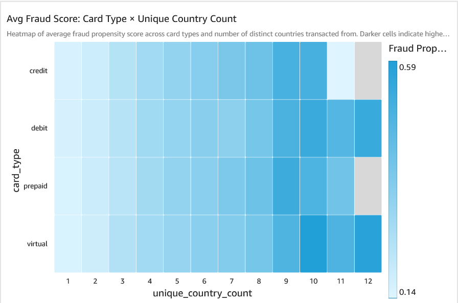
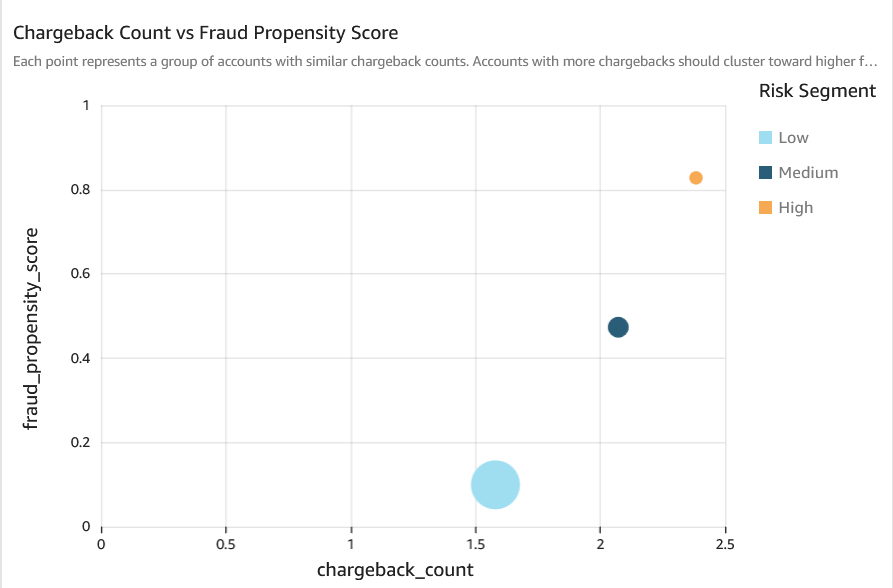
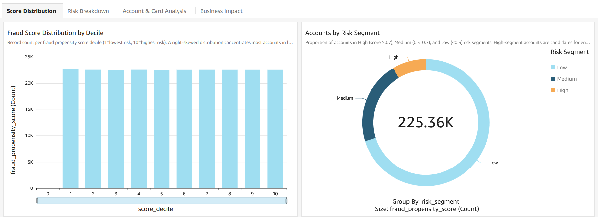
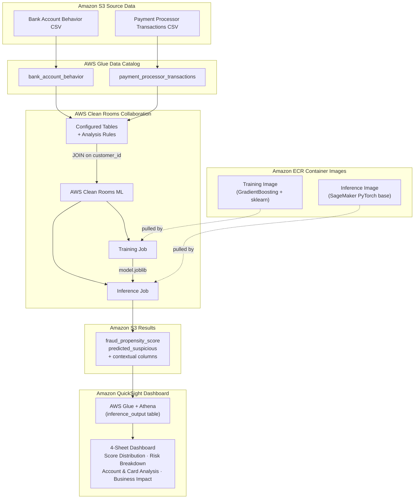

# Detect Financial Fraud Propensity Earlier by Combining Bank Data and Payment Processor Data using AWS Clean Rooms ML

[](https://opensource.org/licenses/MIT-0)

Self-contained demo showing how a **bank** and a **payment processor** can jointly score every shared customer for fraud risk — without either institution ever exposing its raw data to the other.

The bank contributes **account behavior signals** (login patterns, authentication failures, device activity, geographic spread) and the payment processor contributes **transaction signals** (chargebacks, declined transactions, cross-border activity, rapid succession events). AWS Clean Rooms ML joins these datasets inside a secure collaboration, trains a fraud propensity model on the combined signal, and scores every customer — all without either party seeing the other's underlying records.

The output is a ranked list of customers by fraud propensity score, visualized in an Amazon QuickSight dashboard that shows which risk segments, card types, and behavioral patterns drive the highest fraud likelihood — enabling earlier detection, reduced losses, and regulatory compliance.

---

## Use Case: Cross-Institution Fraud Propensity Scoring

**Scenario:** A bank (Party A) and a payment processor (Party B) want to collaborate on predicting which customers are most likely to be involved in fraudulent activity, based on combined account behavior and transaction signals. Neither party can share raw data due to regulatory constraints (GDPR, PSD2, bank secrecy laws).

**Solution:** AWS Clean Rooms ML enables both parties to contribute their data to a secure collaboration. Clean Rooms joins the datasets on a shared key (`customer_id`), trains a fraud propensity model on the combined features, and runs inference — all without either party seeing the other's raw data.

**Business Value:** The bank can identify high-risk accounts for enhanced monitoring, while the payment processor gains insight into which accounts exhibit suspicious cross-channel patterns — enabling earlier fraud detection, reduced losses, and regulatory compliance.

---

## Data Overview

The demo uses two synthetic datasets generated by `data/generate_synthetic_data.py`. The data simulates a realistic scenario with correlated signals between account behavior and transaction patterns.

### Population

| Metric | Value |
|--------|-------|
| Total unique customers | 50,000 |
| Shared customers (in both datasets) | 40,000 (80%) |
| Bank-only customers | 5,000 (10%) |
| Payment-processor-only customers | 5,000 (10%) |
| Date range | Jan 1 – Jun 30, 2025 |

### Party A — Bank Account Behavior Data

**~101,000 rows** — each row represents one customer's aggregated behavior for a specific account.

| Column | Type | Description |
|--------|------|-------------|
| customer_id | string | Unique customer identifier (join key) |
| account_id | string | Bank account identifier |
| login_count | int | Number of online banking logins |
| failed_auth_attempts | int | Number of failed authentication attempts |
| account_age_days | int | Age of the account in days |
| linked_devices | int | Number of devices linked to the account |
| avg_transaction_value | float | Average transaction value for the account |
| geo_spread_score | float | Geographic spread of transactions (0–1) |
| night_activity_ratio | float | Fraction of logins between 11pm–5am (0–1) |
| avg_session_duration_min | float | Average session duration in minutes |
| ip_change_frequency | float | How often IP changes per login session (0–1) |
| dormant_reactivation | int | 1 if account was dormant >90 days then reactivated |
| observation_date | date | Date of the observation record |

### Party B — Payment Processor Transaction Signal Data

**~113,000 rows** — each row represents one customer's transaction signals for a specific card type.

| Column | Type | Description |
|--------|------|-------------|
| customer_id | string | Unique customer identifier (join key) |
| card_type | string | Card type: credit, debit, prepaid, virtual |
| chargeback_count | int | Number of chargebacks filed |
| declined_transactions | int | Number of declined transactions |
| transaction_velocity | float | Transactions per day (rolling 30-day average) |
| merchant_category_diversity | int | Number of distinct merchant categories |
| cross_border_ratio | float | Ratio of cross-border to domestic transactions |
| days_since_last_dispute | int | Days since most recent dispute |
| last_dispute_date | date | Date of last dispute |
| avg_txn_amount | float | Average transaction amount |
| txn_amount_stddev | float | Standard deviation of transaction amounts |
| weekend_txn_ratio | float | Fraction of transactions on weekends (0–1) |
| rapid_succession_count | int | Transactions within 1 minute of each other |
| unique_country_count | int | Number of distinct countries transacted from |
| is_suspicious | int | Ground-truth label: 1 = suspicious, 0 = not |

### Latent Fraud Propensity Model (Data Generation)

The synthetic data uses two semi-independent latent risk dimensions per customer — a bank-side risk score and a processor-side risk score — with moderate correlation (~0.3). The `is_suspicious` label is derived from a weighted combination of both scores (45% bank + 45% processor + 10% noise), ensuring that neither party alone can predict fraud well. This design forces the ML model to leverage features from both parties for optimal performance.

Higher bank-side risk drives:
- More failed authentication attempts and linked devices
- Higher geographic spread and night activity ratios
- More frequent IP changes and shorter sessions

Higher processor-side risk drives:
- More chargebacks, declined transactions, and rapid succession events
- Higher transaction velocity and amount variance
- More cross-border activity and unique countries

---

## Feature Engineering

**Clean Rooms Mode:** When Clean Rooms ML runs training, it joins the two tables on `customer_id` and sends a single pre-joined, headerless CSV to the training container. The `customer_id` column is excluded (it's the join key). The training script detects this format and applies column names automatically.

### Features Used (Clean Rooms Mode)

| Feature | Source | Description |
|---------|--------|-------------|
| login_count | Bank | Number of online banking logins |
| failed_auth_attempts | Bank | Failed authentication attempts |
| account_age_days | Bank | Account age in days |
| linked_devices | Bank | Devices linked to account |
| avg_transaction_value | Bank | Average transaction value |
| geo_spread_score | Bank | Geographic spread (0–1) |
| night_activity_ratio | Bank | Fraction of logins between 11pm–5am |
| avg_session_duration_min | Bank | Average session duration in minutes |
| ip_change_frequency | Bank | IP change rate per login session |
| dormant_reactivation | Bank | 1 if dormant account reactivated |
| auth_failure_rate | Derived | failed_auth_attempts / login_count |
| chargeback_count | Payment Processor | Number of chargebacks |
| declined_transactions | Payment Processor | Number of declined transactions |
| transaction_velocity | Payment Processor | Transactions per day |
| merchant_category_diversity | Payment Processor | Distinct merchant categories |
| cross_border_ratio | Payment Processor | Cross-border transaction ratio |
| days_since_last_dispute | Payment Processor | Recency of last dispute |
| avg_txn_amount | Payment Processor | Average transaction amount |
| txn_amount_stddev | Payment Processor | Transaction amount standard deviation |
| weekend_txn_ratio | Payment Processor | Fraction of weekend transactions |
| rapid_succession_count | Payment Processor | Transactions within 1 min of each other |
| unique_country_count | Payment Processor | Distinct countries transacted from |
| decline_rate | Derived | declined_transactions / (declined + velocity × 30) |

**Target variable:** `is_suspicious` (1 = suspicious, 0 = not suspicious)

### Features Used (Local/SageMaker Mode)

When running locally or via SageMaker (two separate CSVs with headers), the training script aggregates per-customer before joining. Additional aggregated features include:

- `num_accounts` — number of distinct bank accounts the customer holds
- `max_linked_devices` — maximum devices across accounts
- `total_failed_auth` — total failed auth attempts across accounts
- `avg_night_ratio` — average night activity ratio across accounts
- `min_session_duration` — minimum session duration across accounts
- `max_ip_change_freq` — maximum IP change frequency across accounts
- `any_dormant` — whether any account was dormant-reactivated
- `num_card_types` — number of distinct card types used
- `total_chargebacks` — aggregated across card types
- `max_cross_border_ratio` — highest cross-border ratio across cards
- `total_rapid_succession` — total rapid succession events
- `max_unique_countries` — maximum unique countries across cards
- `max_txn_stddev` — maximum transaction amount standard deviation

---

## Analysis & Model Training

### Model Architecture

| Parameter | Value |
|-----------|-------|
| Algorithm | Gradient Boosting Classifier (sklearn) |
| Train/Test Split | 80% / 20%, stratified by target |
| n_estimators | 100 |
| max_depth | 5 |
| learning_rate | 0.1 |
| Random seed | 42 |

### Training Flow in Clean Rooms ML

1. Clean Rooms joins bank and payment processor tables on `customer_id` inside the collaboration
2. The pre-joined data (headerless CSV, no `customer_id` column) is sent to the training container
3. The training script detects the headerless format and applies column names
4. Derived features (`auth_failure_rate`, `decline_rate`) are computed
5. GradientBoostingClassifier is trained on the 23 features with `is_suspicious` as target
6. Model artifacts (`model.joblib`, `feature_columns.json`) are saved to `/opt/ml/model`
7. Metrics (accuracy, precision, recall, F1, ROC-AUC) are saved to `/opt/ml/output/data`

### Inference Flow in Clean Rooms ML

1. Clean Rooms sends the same pre-joined data to the inference container
2. The inference handler loads the trained model and feature column list
3. Derived features are computed on the fly (same as training)
4. Model predicts `fraud_propensity_score` (0–1) and `predicted_suspicious` (0/1) for each record
5. Results are written as CSV to the configured output S3 bucket

### Container Requirements

- **Training container:** Any Python image with sklearn, pandas, numpy, joblib (we used `python:3.11-slim` as base, wrapped in the SageMaker PyTorch training image)
- **Inference container:** Must use the SageMaker PyTorch inference base image: `pytorch-inference:2.3.0-cpu-py311-ubuntu20.04-sagemaker`. Clean Rooms ML requires this specific base image for inference — using a generic Python image causes `AlgorithmError` failures.

---

## Results

After successful inference, Clean Rooms ML writes the output to the configured S3 bucket. The output contains a fraud propensity score and binary prediction for each record in the pre-joined dataset.

**Output S3 path:** `s3://cleanrooms-ml-fsi-output-<ACCOUNT_ID>-<RUN_ID>/cleanrooms-ml-output/`

### Output Format

| Column | Type | Description |
|--------|------|-------------|
| fraud_propensity_score | float (0–1) | Predicted probability of suspicious activity |
| predicted_suspicious | int (0/1) | Binary prediction: 1 = likely suspicious |

### Interpreting the Results

- `fraud_propensity_score > 0.5` → predicted as likely suspicious (`predicted_suspicious = 1`)
- Higher scores indicate stronger fraud signals based on combined account + transaction patterns
- The bank can use these scores to prioritize accounts for enhanced due diligence
- The payment processor can identify which accounts exhibit cross-channel suspicious patterns
- Scores are generated for all records in the pre-joined dataset (~225K rows)

### Key Metrics (from training evaluation)

The model is evaluated on a held-out 20% test set during training. Typical metrics for this synthetic dataset:

| Metric | Both Parties (Clean Rooms) | Bank Only | Processor Only |
|--------|---------------------------|-----------|----------------|
| Accuracy | ~83% | ~78% | ~78% |
| Precision | ~73% | ~64% | ~63% |
| Recall | ~47% | ~25% | ~32% |
| F1 Score | ~0.57 | ~0.36 | ~0.43 |
| ROC-AUC | ~0.87 | ~0.77 | ~0.80 |

### Collaboration Value

The metrics above demonstrate the core value of the clean room collaboration:

- Combining data from both parties yields a **~10-point ROC-AUC improvement** over either party alone
- F1 score nearly doubles compared to bank-only predictions
- Feature importance is well-distributed across 15+ features from both parties, with no single feature dominating (top feature accounts for ~10% of importance)

> **Note:** These are approximate ranges for the synthetic data. Actual metrics depend on the random seed and data split. The performance gap between single-party and combined models reflects the intentionally designed dual-risk-dimension data generation process.

---

## End-to-End Setup Guide

### Prerequisites

- Python 3.10+ with `boto3`, `pandas`, `scikit-learn`, `joblib` installed
- AWS CLI configured with valid credentials
- AWS account with Clean Rooms ML access enabled

> **Optional — QuickSight Dashboard (Step 6):** If you plan to run `scripts/create_dashboard.py`, your `AWS_REGION` must be a region where Amazon QuickSight is available. QuickSight, Athena, Glue, and S3 must all be in the same region — cross-region Athena connections are not supported by QuickSight. Supported regions include `us-east-1`, `us-east-2`, `us-west-2`, `eu-west-1`, `eu-west-2`, `eu-central-1`, `eu-north-1`, `ap-northeast-1`, `ap-southeast-1`, `ap-southeast-2`, `ap-south-1`, and others. See the [full list](https://docs.aws.amazon.com/quicksight/latest/user/regions-qs.html). Also set `QS_NOTIFICATION_EMAIL` in `config.py` to a valid email address — this is required for QuickSight account registration and is validated at script startup.

### Step 0: Configure Your Account

Edit `config.py` and set your values:

```python
AWS_ACCOUNT_ID        = "123456789012"   # Your 12-digit AWS account ID
AWS_REGION            = "us-east-1"      # Your preferred region
QS_NOTIFICATION_EMAIL = "your@email.com" # Optional: only needed for Step 6 (QuickSight)
```

### Step 1: Generate Synthetic Data

```bash
python data/generate_synthetic_data.py
```

### Step 2: Upload Data to S3

```bash
python scripts/upload_data.py
```

### Step 3: Build & Push Docker Containers

**Option A — via CodeBuild:**
```bash
python scripts/codebuild_containers.py
```

**Option B — via local Docker:**
```bash
python scripts/build_and_push.py
```

### Step 4: Set Up Clean Rooms Infrastructure

```bash
python scripts/setup_cleanrooms.py
```

### Step 5: Train Model & Run Inference

```bash
python scripts/run_cleanrooms_ml.py
```

### Step 6: Create QuickSight Dashboard

**Script:** `scripts/create_dashboard.py`

```bash
python scripts/create_dashboard.py
```

This creates a fully automated Amazon QuickSight dashboard on top of the inference output. The script is idempotent — safe to re-run, it will update existing resources in place.

What it does:
1. Registers the inference output CSV as an AWS Glue table so Athena can query it
2. Creates an Athena data source in QuickSight
3. Creates a QuickSight dataset with derived fields (`risk_segment`, `score_decile`, `risk_exposure`)
4. Creates and publishes a 4-sheet dashboard:
   - **Score Distribution** — fraud score histogram by decile, risk segment donut, lift table, suspicious vs clean comparison
   - **Risk Breakdown** — avg fraud score by card type, chargeback vs score scatter, velocity and cross-border ratio by segment
   - **Account & Card Analysis** — segment summary table, highest-risk accounts list, suspicious rate cross-tab by segment × card type
   - **Business Impact** — suspicious accounts captured by decile, risk exposure by segment, fraud score heatmap by card type × country count

**Output:** Dashboard URL printed at the end, e.g.:
```
https://us-east-1.quicksight.aws.amazon.com/sn/dashboards/cleanrooms-ml-fsi-fraud-fraud-dashboard
```

#### Dashboard Screenshots

**Score Distribution**


**Risk Breakdown**


**Account & Card Analysis**


> **Note:** To download the raw inference output from S3 instead:
> ```bash
> aws s3 cp s3://cleanrooms-ml-fsi-fraud-output-<ACCOUNT_ID>-<RUN_ID>/cleanrooms-ml-output/ ./results/ --recursive --region <REGION>
> ```

---

## Architecture Diagram



---

## Optional: Local Testing

```bash
python scripts/test_training_local.py
```

## Optional: SageMaker Direct Training

```bash
python scripts/sagemaker_training_job.py
```

---

## Project Structure

```
config.py                          ← SET YOUR ACCOUNT + REGION HERE
README.md                         ← This file
buildspec.yml                     ← CodeBuild spec
data/
  generate_synthetic_data.py      ← Generates synthetic bank + payment processor CSVs
containers/
  training/
    Dockerfile                    ← Parameterized base image via ARG
    train.py                      ← GradientBoosting training script (fraud detection)
  inference/
    Dockerfile                    ← Parameterized base image via ARG
    serve.py                      ← HTTP server (/ping + /invocations)
    inference_handler.py          ← Model loading + prediction logic
scripts/
  upload_data.py                  ← Upload CSVs to S3 + create buckets
  codebuild_containers.py         ← Build containers via CodeBuild (no local Docker)
  build_and_push.py               ← Build containers via local Docker
  setup_cleanrooms.py             ← Create Glue, IAM, collaboration, ML config
  run_cleanrooms_ml.py            ← Create channels, train model, run inference
  create_dashboard.py             ← Optional: create QuickSight dashboard (Step 6)
  test_training_local.py          ← Test training locally (no AWS needed)
  sagemaker_training_job.py       ← Optional: run training via SageMaker directly
```

---

## License

This library is licensed under the MIT-0 License.
